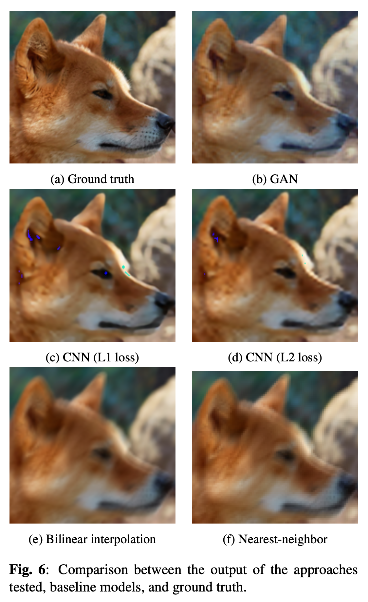

# Image_Super_Resolution

This repo contains the code and the report produced to tackle the Image Super resolution task.

**Dataset:** NTIRE 2017 Super Resolution Challenge (https://data.vision.ee.ethz.ch/cvl/ntire17/)

## To execute and replicate the results written in the report run the file 'main.py'. This should create two folders: 'project_log' and 'ouput_images'.

The first contains the file 'assignment.log' where the results are going to be written, while the second contains the output images of all the proposed approaches:

- **nearest-neighbor (baseline)**
- **bilinear interpolation (baseline)**
- **PSNR-oriented CNN**
- **GAN**

For more details on the approaches proposed refer to the report **'SR_report.pdf'** contained in this repo.

The image below shows an example of the output of the proposed methods.

